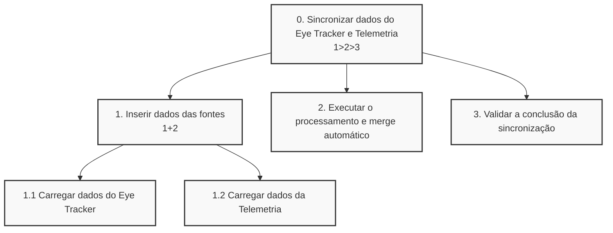
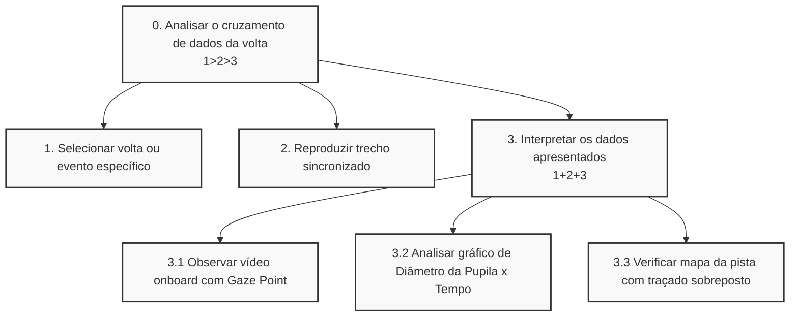

# Análise de Tarefas

Com base no cenário de uso do nosso sistema no *Pit Lane* de autódromos e na necessidade de agilidade da operadora (Anna) e do piloto (Humberto), mapeamos as duas tarefas mais críticas para o sucesso da aplicação:

1. Realizar a sincronização (Merge) automática dos dados pós-sessão.
2. Analisar o desempenho e a carga cognitiva do piloto visualmente.

Abaixo, apresentamos a modelagem HTA (Análise Hierárquica de Tarefas) destas duas interações principais através das suas respetivas tabelas detalhadas e diagramas de árvore.

---

### Tarefa 1: Realizar a sincronização (Merge) automática dos dados

Esta tarefa descreve a principal dor resolvida pelo sistema: a unificação rápida dos dados de vídeo (Eye Tracker) com a telemetria (carro) logo após o piloto regressar às boxes.

| Objetivos/Operações | Problemas e Recomendações |
| :--- | :--- |
| **0. Sincronizar dados do Eye Tracker e Telemetria (1>2>3)** | **Input:** Conexão do cabo USB com os ficheiros brutos de telemetria e rastreamento ocular. **Feedback:** Barra de progresso a indicar o sincronismo e mensagem de "✅ Sincronizado!". **Plano:** Inserir os dados no sistema, acionar o merge automático e validar se a integração ocorreu com sucesso. **Recomendação:** O sistema deve executar esta tarefa inteira em aproximadamente 30 segundos para não atrasar o setup da próxima corrida. |
| **1. Inserir dados das fontes (1+2)** | **Plano:** O sistema deve ler paralelamente os ficheiros gerados pelo hardware de telemetria e pelos óculos Pupil Core. |
| 1.1 Carregar dados do Eye Tracker (vídeo e pupila) | **Problema:** Timestamps de equipamentos diferentes podem vir dessincronizados na origem. **Recomendação:** Utilizar um algoritmo de alinhamento temporal robusto para evitar que a operadora tenha de usar folhas de cálculo (Excel) manualmente. |
| 1.2 Carregar dados da Telemetria (travagem, aceleração, etc.) | **Problema:** O ficheiro `.csv` pode conter dezenas de colunas desnecessárias. **Recomendação:** O sistema deve filtrar automaticamente apenas as métricas relevantes (travagem, esterçamento, velocidade). |
| **2. Executar o processamento e merge automático** | **Ação:** O algoritmo faz a junção das fontes e calcula as métricas pupilares (TLP, TEPR). |
| **3. Validar a conclusão da sincronização** | **Recomendação:** O feedback visual deve ser claro e imediato (ex: ecrã verde), considerando o ambiente hostil de alta pressão e iluminação variável das boxes. |

**Diagrama HTA - Tarefa 1:**

---

### Tarefa 2: Analisar o desempenho e a carga cognitiva do piloto

Esta tarefa é o momento da verdade, onde Humberto e Anna consomem os dados processados para identificar pontos de melhoria (ex: "olhou tarde para o corretor").

| Objetivos/Operações | Problemas e Recomendações |
| :--- | :--- |
| **0. Analisar o cruzamento de dados da volta (1>2>3)** | **Input:** Seleção de um trecho específico da pista no sistema. **Feedback:** Visualização de um *dashboard* com vídeo, gráficos e mapa. **Plano:** Escolher a volta de interesse, reproduzir o replay sincronizado e interpretar as três fontes de dados sobrepostas. **Recomendação:** A interface deve ter alto contraste e botões grandes para facilitar a leitura por um piloto cansado e com níveis altos de adrenalina. |
| **1. Selecionar volta ou evento específico** | **Plano:** Escolher a volta ou curva em que o piloto relatou problemas (ex: "Volta 5 - Curva 3"). |
| **2. Reproduzir trecho sincronizado** | **Ação:** Dar play no *dashboard* de análise. |
| **3. Interpretar os dados apresentados (1+2+3)** | **Plano:** Observar paralelamente o vídeo da pista, o comportamento fisiológico e o traçado do carro. |
| 3.1 Observar vídeo *onboard* com o *Gaze Point* | **Recomendação:** A "bolinha do olho" deve ser bem destacada no ecrã para que o erro de foco visual seja irrefutável e de rápido entendimento. |
| 3.2 Analisar gráfico de Diâmetro da Pupila x Tempo | **Problema:** Pilotos podem não entender gráficos complexos de carga cognitiva. **Recomendação:** Traduzir os picos de dilatação com indicativos visuais simples de "Sobrecarga Cognitiva" ou "Fadiga" para facilitar o entendimento a leigos. |
| 3.3 Verificar mapa da pista com traçado sobreposto | **Ação:** Comparar se o local exato onde a pupila dilatou (ex: no retrovisor) causou perda de tempo no traçado (ex: entrada atrasada na curva). |

**Diagrama HTA - Tarefa 2:**

