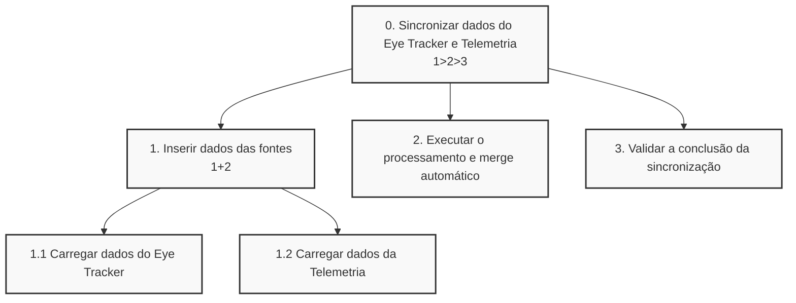
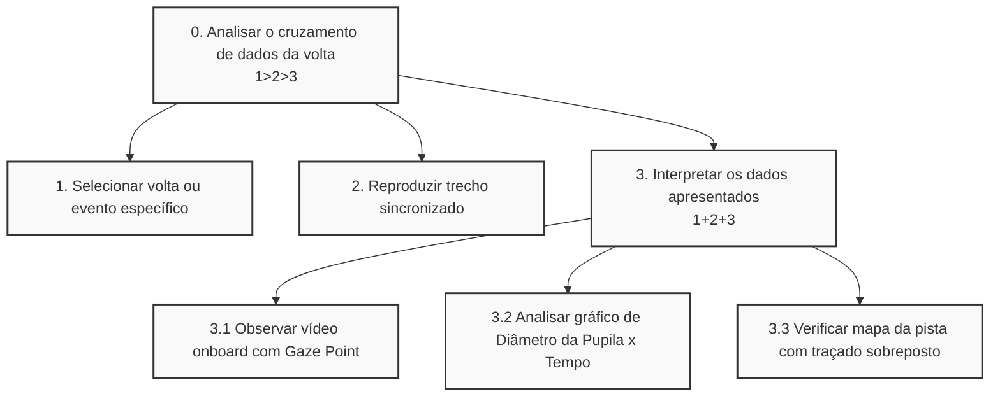

# Análise de Tarefas

Com base no cenário de uso do nosso sistema no *Pit Lane* de autódromos e na necessidade de agilidade da operadora (Anna) e do piloto (Humberto), mapeamos as duas tarefas mais críticas para o sucesso da aplicação:

1. Realizar a sincronização (Merge) automática dos dados pós-sessão.
2. Analisar o desempenho e a carga cognitiva do piloto visualmente.

Abaixo, apresentamos a modelagem HTA (Análise Hierárquica de Tarefas) destas duas interações principais através das suas respetivas tabelas detalhadas e diagramas de árvore.

---

### Tarefa 1: Realizar a sincronização (Merge) automática dos dados

Esta tarefa descreve a principal dor resolvida pelo sistema: a unificação rápida dos dados de vídeo (Eye Tracker) com a telemetria (carro) logo após o piloto regressar às boxes.

| Objetivos/Operações | Problemas e Recomendações |
| :--- | :--- |
| **0. Sincronizar dados do Eye Tracker e Telemetria (1>2>3)** | **Input:** Conexão do cabo USB com os ficheiros brutos de telemetria e rastreamento ocular.<br>**Feedback:** Barra de progresso a indicar o sincronismo e mensagem de "✅ Sincronizado!".<br>**Plano:** Inserir os dados no sistema, acionar o merge automático e validar se a integração ocorreu com sucesso.<br>**Recomendação:** O sistema deve executar esta tarefa inteira em aproximadamente 30 segundos para não atrasar o setup da próxima corrida. |
| **1. Inserir dados das fontes (1+2)** | **Plano:** O sistema deve ler paralelamente os ficheiros gerados pelo hardware de telemetria e pelos óculos Pupil Core. |
| 1.1 Carregar dados do Eye Tracker (vídeo e pupila) | **Problema:** Timestamps de equipamentos diferentes podem vir dessincronizados na origem.<br>**Recomendação:** Utilizar um algoritmo de alinhamento temporal robusto para evitar que a operadora tenha de usar folhas de cálculo (Excel) manualmente. |
| 1.2 Carregar dados da Telemetria (travagem, aceleração, etc.) | **Problema:** O ficheiro `.csv` pode conter dezenas de colunas desnecessárias.<br>**Recomendação:** O sistema deve filtrar automaticamente apenas as métricas relevantes (travagem, esterçamento, velocidade). |
| **2. Executar o processamento e merge automático** | **Ação:** O algoritmo faz a junção das fontes e calcula as métricas pupilares (TLP, TEPR). |
| **3. Validar a conclusão da sincronização** | **Recomendação:** O feedback visual deve ser claro e imediato (ex: ecrã verde), considerando o ambiente hostil de alta pressão e iluminação variável das boxes. |

**Diagrama HTA - Tarefa 1:**



---

### Tarefa 2: Analisar o desempenho e a carga cognitiva do piloto

Esta tarefa é o momento da verdade, onde Humberto e Anna consomem os dados processados para identificar pontos de melhoria (ex: "olhou tarde para o corretor").

| Objetivos/Operações | Problemas e Recomendações |
| :--- | :--- |
| **0. Analisar o cruzamento de dados da volta (1>2>3)** | **Input:** Seleção de um trecho específico da pista no sistema.<br>**Feedback:** Visualização de um *dashboard* com vídeo, gráficos e mapa.<br>**Plano:** Escolher a volta de interesse, reproduzir o replay sincronizado e interpretar as três fontes de dados sobrepostas.<br>**Recomendação:** A interface deve ter alto contraste e botões grandes para facilitar a leitura por um piloto cansado e com níveis altos de adrenalina. |
| **1. Selecionar volta ou evento específico** | **Plano:** Escolher a volta ou curva em que o piloto relatou problemas (ex: "Volta 5 - Curva 3"). |
| **2. Reproduzir trecho sincronizado** | **Ação:** Dar play no *dashboard* de análise. |
| **3. Interpretar os dados apresentados (1+2+3)** | **Plano:** Observar paralelamente o vídeo da pista, o comportamento fisiológico e o traçado do carro. |
| 3.1 Observar vídeo *onboard* com o *Gaze Point* | **Recomendação:** A "bolinha do olho" deve ser bem destacada no ecrã para que o erro de foco visual seja irrefutável e de rápido entendimento. |
| 3.2 Analisar gráfico de Diâmetro da Pupila x Tempo | **Problema:** Pilotos podem não entender gráficos complexos de carga cognitiva.<br>**Recomendação:** Traduzir os picos de dilatação com indicativos visuais simples de "Sobrecarga Cognitiva" ou "Fadiga" para facilitar o entendimento a leigos. |
| 3.3 Verificar mapa da pista com traçado sobreposto | **Ação:** Comparar se o local exato onde a pupila dilatou (ex: no retrovisor) causou perda de tempo no traçado (ex: entrada atrasada na curva). |

**Diagrama HTA - Tarefa 2:**



## Modelo GOMS

O modelo GOMS descreve o conhecimento necessário para que um utilizador atinja os seus objetivos através da interface do sistema, detalhando objetivos, métodos, operadores e regras de seleção.

Abaixo, detalhamos o modelo GOMS para a tarefa principal da Anna: diagnosticar um erro do piloto através da sincronização de dados.

**GOAL 0:** Analisar a carga cognitiva e o erro visual numa curva específica
* **GOAL 1:** Sincronizar os dados da sessão
  * **METHOD 1.A:** Sincronização automática via cabo USB
    * *(SEL. RULE: O piloto acabou de chegar às boxes e os dados brutos estão nos dispositivos)*
    * **OP 1.A.1:** Ligar o cabo USB dos dispositivos ao computador
    * **OP 1.A.2:** Deslocar o rato para o botão "Importar Sessão"
    * **OP 1.A.3:** Clicar com o botão esquerdo do rato
    * **OP 1.A.4:** Aguardar e verificar o feedback visual (barra verde de "Sincronizado")
* **GOAL 2:** Localizar o evento crítico (a curva com erro)
  * **METHOD 2.A:** Selecionar a volta na lista de histórico
    * *(SEL. RULE: O piloto sabe em qual volta cometeu o erro, ex: "Volta 5")*
    * **OP 2.A.1:** Deslocar o cursor do rato para a lista de voltas
    * **OP 2.A.2:** Clicar sobre a volta correspondente
* **GOAL 3:** Interpretar o comportamento visual e fisiológico do piloto
  * **METHOD 3.A:** Analisar o *dashboard* de forma integrada
    * **OP 3.A.1:** Clicar em "Reproduzir" no vídeo *onboard*
    * **OP 3.A.2:** Examinar visualmente a posição do *Gaze Point* (bolinha do olhar) no ecrã
    * **OP 3.A.3:** Examinar o gráfico de Diâmetro Pupilar para identificar picos de sobrecarga
    * **OP 3.A.4:** Comparar os dados anteriores com o traçado do carro no mapa

---

## Modelo CTT (ConcurTaskTrees)

O modelo CTT permite-nos visualizar a hierarquia e a relação temporal ou de concorrência entre as tarefas. O CTT classifica as tarefas em quatro tipos: tarefas do utilizador (realizadas mentalmente/fora do sistema), do sistema (processamento sem interação), interativas (diálogo utilizador-sistema) e abstratas (composição de outras tarefas).

Neste cenário, modelamos a "Avaliação de Performance" realizada pela Anna no *Pit Lane*.

**Legenda de Relações CTT utilizadas:**
* `>>` : Ativação (a segunda inicia após o fim da primeira)
* `[]>>` : Ativação com passagem de informação (os dados da primeira alimentam a segunda)
* `|||` : Tarefas concorrentes (podem ser realizadas ao mesmo tempo)

**Estrutura CTT (em formato de lista hierárquica):**

1. **Avaliar Performance Cognitiva do Piloto** `[Tarefa Abstrata]`

   1.1. **Importar e Sincronizar Dados** `[Tarefa Abstrata]` `[]>>` *(passa os dados sincronizados para)* 1.2

       1.1.1. Ligar dispositivos via USB `[Tarefa Interativa]` `>>`

       1.1.2. Acionar "Merge Automático" `[Tarefa Interativa]` `[]>>`

       1.1.3. Processar Merge (Vídeo + Telemetria) `[Tarefa do Sistema]`

   1.2. **Analisar Volta Específica** `[Tarefa Abstrata]` `>>` 1.3

       1.2.1. Selecionar a volta no sistema `[Tarefa Interativa]` `[]>>`

       1.2.2. Reproduzir vídeo sincronizado `[Tarefa Interativa]` `|||` *(concorre com)* 1.2.3

       1.2.3. Interpretar onde o piloto olhou (Gaze) `[Tarefa do Utilizador]` `|||`

       1.2.4. Interpretar carga no gráfico pupilar `[Tarefa do Utilizador]`

   1.3. **Gerar Relatório de Fadiga para Preparador Físico** `[Tarefa Abstrata]`

       1.3.1. Clicar em Exportar PDF `[Tarefa Interativa]` `[]>>`

       1.3.2. Compilar dados longitudinais `[Tarefa do Sistema]`

### Diagrama CTT

```mermaid
graph TD
    T0("Avaliar Performance Cognitiva do Piloto<br>[Abstrata]") --> T1("1.1 Importar e Sincronizar Dados<br>[Abstrata]")
    T0 --> T2("1.2 Analisar Volta Específica<br>[Abstrata]")
    T0 --> T3("1.3 Gerar Relatório de Fadiga<br>[Abstrata]")

    %% Relações de Nível 1
    T1 -- "[]>>" --> T2
    T2 -- ">>" --> T3

    %% Decomposição de 1.1
    T1 --> T1_1("Ligar dispositivos<br>[Interativa]")
    T1 --> T1_2("Acionar Merge Automático<br>[Interativa]")
    T1 --> T1_3("Processar Merge<br>[Sistema]")
    T1_1 -- ">>" --> T1_2
    T1_2 -- "[]>>" --> T1_3

    %% Decomposição de 1.2
    T2 --> T2_1("Selecionar Volta<br>[Interativa]")
    T2 --> T2_2("Reproduzir Vídeo<br>[Interativa]")
    T2 --> T2_3("Interpretar Gaze Point<br>[Utilizador]")
    T2 --> T2_4("Interpretar Gráfico Pupilar<br>[Utilizador]")
    
    T2_1 -- "[]>>" --> T2_2
    T2_2 -- "|||" --> T2_3
    T2_3 -- "|||" --> T2_4

    %% Decomposição de 1.3
    T3 --> T3_1("Clicar Exportar PDF<br>[Interativa]")
    T3 --> T3_2("Compilar dados longitudinais<br>[Sistema]")
    T3_1 -- "[]>>" --> T3_2

    classDef abstrata fill:#e1f5fe,stroke:#01579b,stroke-width:2px;
    classDef interativa fill:#fff9c4,stroke:#fbc02d,stroke-width:2px;
    classDef sistema fill:#e8f5e9,stroke:#2e7d32,stroke-width:2px;
    classDef utilizador fill:#fce4ec,stroke:#c2185b,stroke-width:2px;

    class T0,T1,T2,T3 abstrata;
    class T1_1,T1_2,T2_1,T2_2,T3_1 interativa;
    class T1_3,T3_2 sistema;
    class T2_3,T2_4 utilizador;
