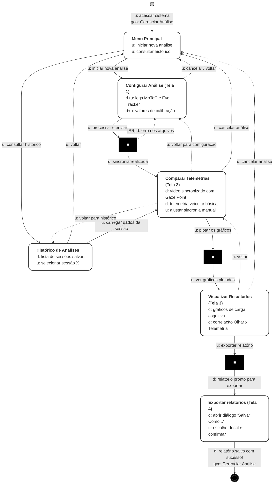

```mermaid 
flowchart TD
    %% Ponto de Abertura e Menu Principal
    Start(( )) --> |"u: acessar sistema<br/>gco: Gerenciar Análise"| Menu

    Menu["`**Menu Principal**
    u: iniciar nova análise
    u: consultar histórico`"]

    %% ==========================================
    %% FLUXO 1: NOVA ANÁLISE (Passa pela Tela 1)
    %% ==========================================
    Menu -->|u: iniciar nova análise| Cena1

    Cena1["`**Configurar Análise (Tela 1)**
    d+u: logs MoTeC e Eye Tracker
    d+u: valores de calibração`"]

    %% Cancelar/Voltar da Tela 1
    Cena1 -.->|u: cancelar / voltar| Menu

    %% Processamento dos Dados
    Preposto1[■]
    Cena1 -->|u: processar e enviar| Preposto1
    Preposto1 -.->|"[SR] d: erro nos arquivos"| Cena1
    
    %% Avança para Tela 2
    Preposto1 -->|"d: sincronia realizada"| Cena2


    %% ==========================================
    %% FLUXO 2: HISTÓRICO (Vai direto para Tela 2)
    %% ==========================================
    Menu -->|u: consultar histórico| Hist["`**Histórico de Análises**
    d: lista de sessões salvas
    u: selecionar sessão X`"]
    
    %% Cancelar/Voltar do Histórico
    Hist -.->|u: voltar| Menu
    
    %% Avança para Tela 2
    Hist -->|u: carregar dados da sessão| Cena2


    %% ==========================================
    %% ENCONTRO DOS FLUXOS (Tela 2)
    %% ==========================================
    Preposto2[■]
    Cena2["`**Comparar Telemetrias (Tela 2)**
    d: vídeo sincronizado com Gaze Point
    d: telemetria veicular básica
    u: ajustar sincronia manual`"]

    %% Transições da Tela 2 (Voltar/Cancelar)
    Cena2 -.->|u: voltar para configuração| Cena1
    Cena2 -.->|u: voltar para histórico| Hist
    Cena2 -.->|u: cancelar análise| Menu
    
    %% Avança para Tela 3
    Cena2 --> |u: plotar os gráficos| Preposto2
    Preposto2 -->|u: ver gráficos plotados| Cena3


    %% ==========================================
    %% TELA 3 E EXPORTAÇÃO
    %% ==========================================
    Cena3["`**Visualizar Resultados (Tela 3)**
    d: gráficos de carga cognitiva
    d: correlação Olhar x Telemetria`"]

    %% Transições da Tela 3
    Cena3 -.->|u: voltar| Cena2
    Cena3 -.->|u: cancelar análise| Menu

    %% Processo de Exportação
    Preposto3[■]
    
    Cena3 -->|u: exportar relatório| Preposto3
    Preposto3 --> |d: relatório pronto para exportar| Cena4
    
    %% Pop-up de Salvamento e Fim
    Cena4["`**Exportar relatórios (Tela 4)**
    d: abrir diálogo 'Salvar Como...'<br/>u: escolher local e confirmar`"]
    Cena4 -->|"d: relatório salvo com sucesso!<br/>gcc: Gerenciar Análise"| End((( )))
    
    %% ==========================================
    %% ESTILIZAÇÃO PADRÃO MOLIC
    %% ==========================================
    style Start fill:#ccc,stroke:#333,stroke-width:2px
    style Menu fill:#fff,stroke:#333,stroke-width:2px,rx:15,ry:15,text-align:left
    style Cena1 fill:#fff,stroke:#333,stroke-width:2px,rx:15,ry:15,text-align:left
    style Cena2 fill:#fff,stroke:#333,stroke-width:2px,rx:15,ry:15,text-align:left
    style Cena3 fill:#fff,stroke:#333,stroke-width:2px,rx:15,ry:15,text-align:left
    style Cena4 fill:#fff,stroke:#333,stroke-width:2px,rx:15,ry:15,text-align:left
    style Hist fill:#fff,stroke:#333,stroke-width:2px,rx:15,ry:15,text-align:left
    style Preposto1 fill:#000,stroke:#000,color:#fff
    style Preposto2 fill:#000,stroke:#000,color:#fff
    style Preposto3 fill:#000,stroke:#000,color:#fff
    style End fill:#000,stroke:#333,stroke-width:2px
```
