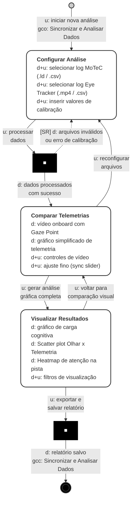

```mermaid 
flowchart TD
    %% Ponto de Abertura (Acesso)
    Start(( )) -->|u: iniciar nova análise<br/>gco: Sincronizar e Analisar Dados| Cena1

    %% Cena 1: Configuração
    Cena1["`**Configurar Análise**
    d+u: selecionar log MoTeC (.ld / .csv)
    d+u: selecionar log Eye Tracker (.mp4 / .csv)
    d+u: inserir valores de calibração`"]
    
    %% Preposto 1: Processamento da Cena 1
    Preposto1[■]
    Cena1 -->|u: processar<br/>dados| Preposto1
    
    %% Caminho de Erro (Tracejado) e Sucesso
    Preposto1 -.->|"[SR] d: arquivos inválidos<br/>ou erro de calibração"| Cena1
    Preposto1 -->|"d: dados processados<br/>com sucesso"| Cena2

    %% Cena 2: Comparação Visual
    Cena2["`**Comparar Telemetrias**
    d: vídeo onboard com Gaze Point
    d: gráfico simplificado de telemetria
    d+u: controles de vídeo
    d+u: ajuste fino (sync slider)`"]
    
    %% Transições da Cena 2
    Cena2 -->|u: reconfigurar<br/>arquivos| Cena1
    Cena2 -->|u: gerar análise<br/>gráfica completa| Cena3

    %% Cena 3: Visualização dos Resultados
    Cena3["`**Visualizar Resultados**
    d: gráfico de carga cognitiva
    d: Scatter plot Olhar x Telemetria
    d: Heatmap de atenção na pista
    d+u: filtros de visualização`"]
    
    %% Transições da Cena 3
    Cena3 -->|u: voltar para<br/>comparação visual| Cena2
    
    %% Preposto 2 e Encerramento
    Preposto2[■]
    Cena3 -->|u: exportar e<br/>salvar relatório| Preposto2
    Preposto2 -->|"d: relatório salvo<br/>gcc: Sincronizar e Analisar Dados"| End((( )))
    
    %% Estilização para ficar no padrão MoLIC
    style Start fill:#ccc,stroke:#333,stroke-width:2px
    style Cena1 fill:#fff,stroke:#333,stroke-width:2px,rx:15,ry:15,text-align:left
    style Cena2 fill:#fff,stroke:#333,stroke-width:2px,rx:15,ry:15,text-align:left
    style Cena3 fill:#fff,stroke:#333,stroke-width:2px,rx:15,ry:15,text-align:left
    style Preposto1 fill:#000,stroke:#000,color:#fff
    style Preposto2 fill:#000,stroke:#000,color:#fff
    style End fill:#000,stroke:#333,stroke-width:2px
```
